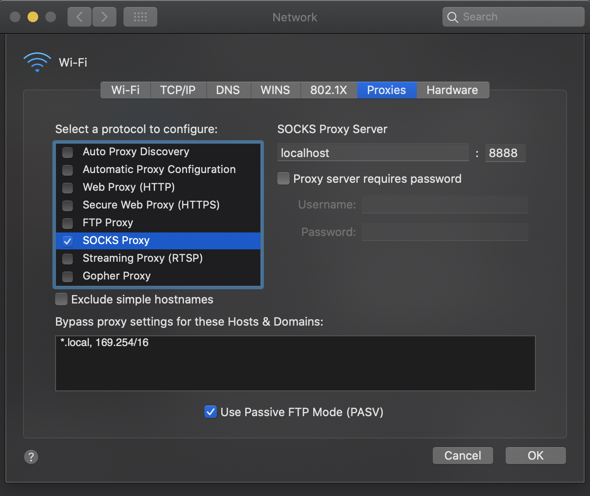

# RSK Enveloping

Support for Metatransactions in RSK. Code here is based on [Gas Stations Network](https://github.com/opengsn/gsn) (GSN). In a nutshell, GSN abstracts away gas to minimize onboarding & UX friction for dapps. With GSN, gasless clients can interact with Ethereum contracts without users needing ETH for transaction fees. The GSN is a decentralized system that improves dapp usability without sacrificing security.

GSN core architecture is defined by the following components:

- **RelayHub** - master contract on the blockchain, to manage all relays, and help clients find them.
- **RelayServer** - a relay service daemon, running as a geth module or standalone HTTP service.  Advertises itself (through the RelayHub) and waits for client requests.
- **RelayClient** - a javascript library for a client to access the blockchain through a relay. Provides APIs to find a good relay, and to send transactions through it. The library hooks the local web3, so that any loaded contract API will go through the relay.

For a full techincal description, see [Tabookey's EIP draft](https://github.com/ethereum/EIPs/blob/master/EIPS/eip-1613.md) and [Open GSN documentation](https://docs.opengsn.org/learn/index.html).

This projects expands GSN capabilities and security model while reducing gas costs by:
- Securely deploying counterfactual SmartWallet proxies for each user account: this eliminates the need of relying in _msgSender() and _msgData() functions.
- Elimination of interaction with Uniswap: relay providers accumulate tokens on a paymaster under their control to later on decide what to do with funds.

## Demo

Try it: https://metacoin.opengsn.org/

Mint and send tokens without requiring ETH for gas. Works on Ropsten and Kovan testnets.

GitHub: https://github.com/opengsn/metacoin

## Documentation

https://docs.opengsn.org/

## How to use (from the project's root directory)

- yarn install
- ./rsknode/rskj.sh (local) or ./rsknode/run.sh (with docker)
- yarn generate && yarn tsc && npx truffle test --network rsk test/Flows.test.ts

## Troubleshooting

### Running on MacOS
If you intend to execute using Docker on a Mac, you must follow these steps or the scripts and web apps won't work.

#### Patch `readlink`
The startup scripts assume that GNU's `readlink` command is available. But MacOS ships with BSD's `readlink`, which is incompatible with GNU's version. So you must patch `readlink`. You can do it as follows:

```
brew install coreutils
ln -s /usr/local/bin/greadlink /usr/local/bin/readlink
```

After this, you must make sure that your `PATH` variable gives priority to `/usr/local/bin` over `/usr/bin`. You can do it with `which readlink`, which should output `/usr/local/bin/readlink`. Alternatively try executing `readlink -f .`, if it works you're ok.

#### Enable SOCKS Server
The demo web app (or any web app acting as a front end) must be able to send requests to the node's RPC API, which is hosted in a container. Therefore, the MacOS host must be able to reach a Docker container. While this works out of the box in Linux, it doesn't in MacOS. We can fix this by enabling a SOCKS server. This requires a new enough Docker version (Docker desktop v2.3.0.3 works).

Start by telling Docker where the SOCKS port will be hosted:
```
cd ~/Library/Group\ Containers/group.com.docker/
mv settings.json settings.json.backup
cat settings.json.backup | jq '.["socksProxyPort"]=8888' > settings.json
```

(If you don't have `jq` and don't want to install it, you can edit `settings.json` directly).

Then enable the SOCKS proxy server on your system: go to `Apple System Preferences → Network → Advanced → Proxies`, and enable "SOCKS Proxy" using "localhost:8888", hit OK and then Apply.



### Common errors

#### A block header must have 16/17 elements or 19/20 including merged-mining fields but it had 19

Check the folder in enveloping/rsknode/, on the `node.conf` file should have:

```
blockchain.config {
    name = regtest
    hardforkActivationHeights = {
        bahamas = 10,
        afterBridgeSync = -1,
        orchid = 10,
        orchid060 = 10,
        wasabi100 = 10,
        twoToThree = 10,
        papyrus200 = 10
    },
    consensusRules = {
        rskip97 = -1 # disable orchid difficulty drop
    }
}
```

#### Running a test, it throws the Error: Cannot find module 'directory-to-the-project/enveloping/rsknode/test/Flows.test.ts'

You should check you're standing in the project's root directory and the test's name is well written without typos

#### Running Flows.test.ts test throws the error: http://localhost:8090 => Error: local view call to 'relayCall()' reverted: view call to 'relayCall'..

You should stop the running node and delete the db used by the node. Run it again and test.

#### Running some test and one of them throws: Error: listen EADDRINUSE: address already in use :::8090

This is the relay server running background. To solve it, you should run the bash file `scripts/kill-relay-server.sh`

#### Changes to the RSKJ node or changes in the `run.sh` script

If you are using Docker, you should delete the old image using `docker image rm rsknode`.
Then delete the folder `rsknode/home/` and finally run `rsknode/run.sh` again (before this step you must download all the new changes).


